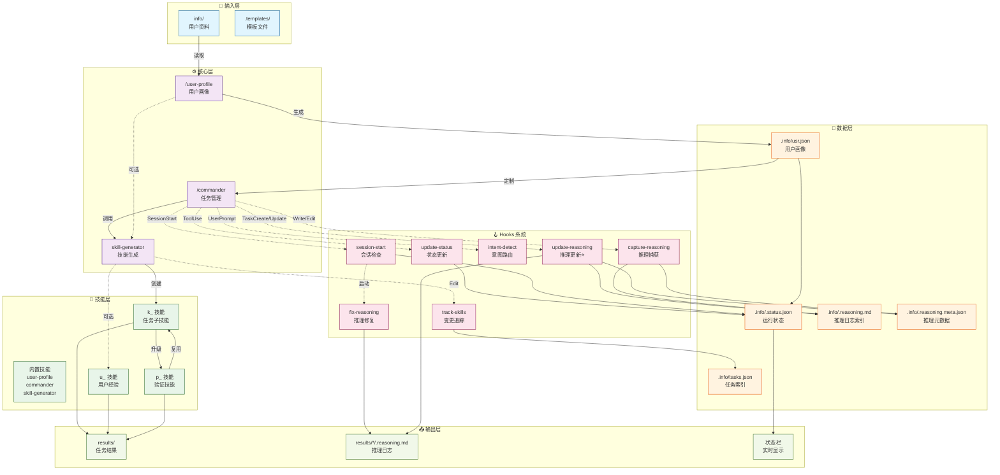

# Skills Demo

基于 Claude Code Skills 的自适应 AI 助手。

## 📹 演示视频


## 系统架构



## 核心思路

```
用户画像 → 任务拆解 → 子技能生成 → 逐步执行 → 结果记录
```

### 工作流程

```
建立画像 → 启动任务 → 两次确认 → 生成技能 → 逐步执行 → 查看推理日志
```

1. **建立画像** - 在 `info/` 目录添加个人信息，运行 `/user-profile`
2. **启动任务** - 使用 `/commander start [任务描述]` 创建新任务
   - 第一次确认：确认任务分析结果（类型、技术栈、参考技能）
   - 第二次确认：确认技能生成计划
3. **执行步骤** - 逐个使用生成的子技能完成每一步
4. **查看推理日志** - 在 `results/k01/.reasoning.md` 查看执行过程和方法论

### 推理日志系统

新推出的推理日志系统自动记录每个任务的执行过程：

- **Mermaid 流程图**：可视化任务进度和方法标签
- **方法论详情表**：展示每个步骤使用的方法和工具
- **执行时间线**：记录关键事件和时间戳
- **推理块捕获**：保存 `<reasoning>` 块中的思考过程

#### 自动维护机制

推理日志通过 Hooks 系统自动维护，无需手动操作：

| Hook | 触发时机 | 作用 |
|:-----|---------|-----|
| `update-reasoning-on-task.sh` | TaskCreate/TaskUpdate | **任务操作时自动更新** |
| `capture-reasoning.sh` | Write/Edit .reasoning.md | 捕获推理块内容 |
| `fix-reasoning.sh` | SessionStart | 修复损坏的推理文件 |

**核心特性**：每次任务操作（创建、更新）都会自动触发推理日志更新。

#### 查看推理日志

```bash
# 查看全局推理索引（活跃任务汇总）
cat .info/.reasoning.md

# 查看特定任务的推理日志
cat results/k01/.reasoning.md

# 查看推理元数据
cat .info/.reasoning.meta.json
```

### 快速开始

**推荐方式**：使用一键启动脚本

```bash
./scripts/start.sh
```

脚本会自动完成：
1. 检查并安装 Claude Code
2. 检查并安装 uv（Python 包管理器）
3. 清理技能文件（k_*, u_*, p_*）
4. 清理旧数据
5. 初始化配置文件

**手动安装**（如需自定义）：

1. **Fork 项目并创建 Codespace**
   - 访问 [Skills Demo](https://github.com/gqy20/Skills_demo)
   - 点击 Fork，然后创建 Codespace

2. **安装 Claude Code**

   macOS/Linux/WSL:
   ```bash
   curl -fsSL https://claude.ai/install.sh | bash
   ```

   Windows PowerShell:
   ```powershell
   irm https://claude.ai/install.ps1 | iex
   ```

3. **配置认证信息**

   ```bash
   export ANTHROPIC_AUTH_TOKEN="your-auth-token-here"
   export ANTHROPIC_BASE_URL="https://open.bigmodel.cn/api/anthropic"
   ```

4. **准备个人信息**

   将任意资料丢入 `info/` 目录（支持 `.md`、`.json`、`.pdf`、`.txt`）

5. **运行第一个任务**

   ```bash
   # 生成用户画像
   /user-profile

   # 启动任务
   /commander start 创建一个 Hello World 页面

   # 执行第一步
   /commander continue k01
   ```

## 📖 详细文档

- [使用指南](docs/usage.md) - 完整命令参考、数据结构说明、工作流示例
- [结果目录说明](docs/results.md) - results/ 目录结构详解
- [状态栏配置](docs/statusline.md) - 自定义状态栏使用说明
- [Hooks 系统](docs/hooks.md) - 自动化钩子详解

### 文件命名规范

| 类型 | 格式 | 示例 |
|:-----|:-----|:-----|
| 测试视频 | `test-<描述>.mp4` | `test-cli-usage.mp4` |
| 演示视频 | `demo-<功能>.mp4` | `demo-skill-upgrade.mp4` |
| 教程视频 | `tutorial-<主题>-<part>.mp4` | `tutorial-hooks-01.mp4` |

## 核心命令

| 命令 | 说明 |
|------|------|
| `/user-profile` | 生成用户画像 |
| `/commander start [任务]` | 启动新任务（两次确认流程） |
| `/commander status` | 全局状态 |
| `/commander progress k01` | 任务进度 |
| `/k01_init_project` | 执行子技能 |
| `cat .info/.reasoning.md` | 查看推理日志全局索引 |
| `cat results/k01/.reasoning.md` | 查看任务推理日志 |
| `cat .info/.reasoning.meta.json` | 查看推理元数据 |

### 推理日志快速查看

```bash
# 查看所有活跃任务的推理摘要
cat .info/.reasoning.md

# 查看特定任务的详细推理过程
cat results/k01/.reasoning.md

# 查看推理元数据（包含所有任务状态）
cat .info/.reasoning.meta.json
```

> 💡 完整命令参考请查看 [使用指南](docs/usage.md#核心命令)

## 设计理念

- **以人为本** - 基于用户画像定制 AI 行为
- **任务驱动** - 将大任务拆解为可执行的子技能
- **过程可见** - 推理日志记录 AI 的思考过程和方法论
- **两次确认** - 分析结果确认 + 技能计划确认，确保准确性
- **并发安全** - 每个任务独立的推理日志，支持多任务并行
